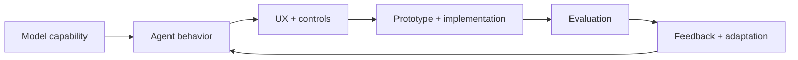

# Hi, I'm Yanice Yang

**AI Product Designer + Product Lead designing agentic-native workflows from model capability to product behavior.**

I work across the full AI product loop: understanding what models can and cannot do, defining how agents should behave, designing how people steer and correct them, and evaluating whether the system actually works.

**Not every agent should look like a chatbot.**

[LinkedIn](https://www.linkedin.com/in/yanice-yang)

## My AI Product Workflow

I treat AI design as more than interface design. My workflow usually spans:

- **Understand model capability** — test what the model handles well, where it becomes unreliable, what context it needs, and which technical constraints affect the experience.
- **Design agent behavior** — define goals, responsibilities, decision boundaries, routing, tool use, memory, constraints, and escalation.
- **Design the UX around that behavior** — decide how users express intent, review evidence, steer generation, correct mistakes, approve actions, and override the system.
- **Prototype the system** — turn product logic into working flows so behavior can be tested with realistic content and edge cases.
- **Evaluate behavior** — create test cases, rubrics, failure modes, and success criteria for the agent, not just the interface.
- **Adapt intentionally** — decide which feedback should change future behavior, and how single-agent or multi-agent systems should evolve.

## What I Build

**Agentic product workflows**  
Systems where AI can research, generate, evaluate, and act across multiple steps while keeping humans in control of important decisions.

**Agent behavior + orchestration**  
I define how agents interpret context, choose actions, use tools, route work, remember information, coordinate with other agents, and escalate when needed.

**Context + control layers**  
UX and harness logic that decide what the AI should know, which rules take priority, what can be remembered, and how corrections change future behavior.

**AI-native product experiences**  
Interfaces built around model capability rather than legacy UI patterns — sometimes conversational, often not.

**Evaluation-driven prototypes**  
Working product flows that make model behavior testable before interaction patterns become fixed.

Some production and client repositories are private. I use GitHub to show the public side of the same practice: reusable AI skills, interaction systems, creative tooling, implementation craft, and validation.

## Selected Public Work

- **[Case Study Illustrations](https://github.com/9929y/yanice-case-study-illustrations)** — a reusable Codex skill with structured workflow rules, visual references, and output guidance for product-design storytelling.
- **[Canvas Studio](https://github.com/9929y/canvas-studio)** — reusable React viewers for product case studies, with responsive behavior, accessibility, and acceptance validation.
- **[Flluid Studio](https://github.com/9929y/flluid-studio)** — a direct-manipulation WebGL tool for making abstract shader behavior understandable through stateful controls.
- **[Cream Studio](https://github.com/9929y/cream-studio)** — a generative art workbench with shared mode contracts, deterministic state, motion, audio response, and export workflows.

## How I Work

1. **Research model capability** — understand modality, strengths, constraints, context needs, and failure patterns.
2. **Define agent behavior** — goals, states, tools, routing, memory, boundaries, and escalation.
3. **Design the experience** — intent, controls, feedback, evidence, review, and correction.
4. **Prototype + build** — make the workflow concrete enough to test with real content.
5. **Evaluate** — test realistic tasks, edge cases, and behavioral quality.
6. **Adapt + orchestrate** — refine behavior, memory, and single- or multi-agent coordination based on evidence.

## Current Focus

- Agentic design for both users and AI agents
- Model capability → product experience
- Agent behavior design
- Context engineering and harness behavior
- Human-in-the-loop AI workflows
- Memory and permission models
- Agent evaluation and failure handling
- Multi-agent orchestration
- Design-to-code systems

## Stack

`Product strategy` `AI Product Design` `Agent behavior design` `Agentic UX` `Workflow architecture` `Context engineering` `Evaluation` `React` `TypeScript` `Astro` `Tailwind` `Supabase` `LangGraph` `Gemini` `Codex` `Three.js`
