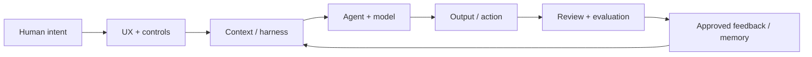

# Hi, I'm Yanice Yang

**AI Product Designer + Product Lead building agentic-native AI workflows.**

I design AI products as systems, not chat windows. My work connects **human intent, structured context, agent behavior, evaluation, and permissioned learning** into workflows people can understand, steer, and trust.

**Not every agent should look like a chatbot.**

[Portfolio](https://yaniceyang.com) · [LinkedIn](https://www.linkedin.com/in/yanice-yang)

## How I Think About Agentic Products

The interface is only one layer. I care about the behavior underneath it:

- **Context engineering** — turn uneven user input, source material, and prior decisions into task-relevant context.
- **Orchestration** — define what the system retrieves, routes, generates, and when it should stop or ask for human input.
- **Human control** — design constraints, review gates, corrections, evidence, and overrides into the workflow.
- **Memory design** — distinguish signals from durable memory; learning should be explicit and permissioned, not silent personalization.
- **Evaluation** — use realistic test cases, rubrics, failure modes, and evidence to judge behavior rather than only output polish.
- **Implementation** — build working prototypes and front-end systems so product behavior can be tested with real content and constraints.

## What I Build

**Agentic product workflows**  
Systems where AI can research, generate, evaluate, and act across multiple steps while keeping humans in control of important decisions.

**Context + control layers**  
UX and harness logic that decide what the AI should know, which rules take priority, what can be remembered, and how corrections change future behavior.

**AI-native creative tools**  
Structured creation environments for image, video, content, and visual exploration that use direct manipulation, presets, references, and review states instead of defaulting to chat.

**Research-to-build systems**  
Artifacts that connect user research, model constraints, workflow architecture, prototypes, implementation, and evaluation into one product loop.

Some production and client repositories are private. I use GitHub to show the public side of the same practice: reusable AI skills, interaction systems, creative tooling, implementation craft, and validation.

## Selected Public Work

- **[Yanice Case Study Illustrations](https://github.com/9929y/yanice-case-study-illustrations)** — a reusable Codex skill with structured workflow rules, visual references, and output guidance for product-design storytelling.
- **[Canvas Studio](https://github.com/9929y/canvas-studio)** — reusable React viewers for product case studies, with responsive behavior, accessibility, and acceptance validation.
- **[Flluid Studio](https://github.com/9929y/flluid-studio)** — a direct-manipulation WebGL tool for making abstract shader behavior understandable through stateful controls.
- **[Cream Studio](https://github.com/9929y/cream-studio)** — a generative art workbench with shared mode contracts, deterministic state, motion, audio response, and export workflows.

## How I Work

1. **Frame** the user goal, product boundary, and success criteria.
2. **Map** actors, states, tools, data, constraints, and failure modes.
3. **Define behavior** across context, routing, priority, memory, and escalation.
4. **Design control** so users can understand, review, correct, and override AI behavior.
5. **Build** a working prototype or production-facing interface.
6. **Evaluate** with realistic tasks, edge cases, evidence, and implementation constraints.
7. **Adapt** only from feedback the system is actually allowed to learn from.

## Current Focus

- Agentic UX beyond chat
- Context engineering and harness behavior
- Human-in-the-loop AI workflows
- Memory and permission models
- Agent evaluation and failure handling
- AI-native creative and operational tools
- Design-to-implementation systems

## Stack

`Product strategy` `Agentic UX` `Workflow architecture` `Context engineering` `Evaluation` `React` `TypeScript` `Astro` `Tailwind` `Supabase` `LangGraph` `Gemini` `Codex` `Three.js`
